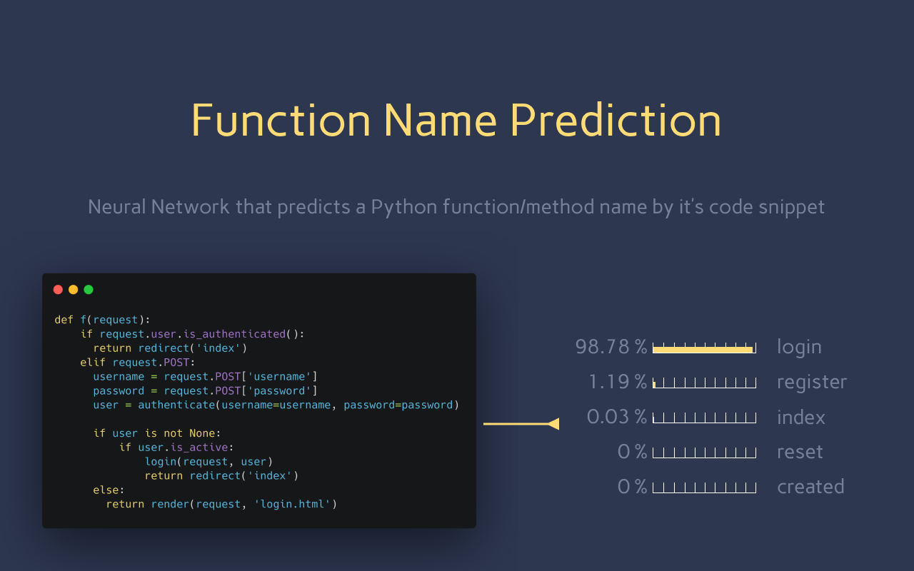

# Function Name Prediction

​	В проекте разработана модель нейронной сети для выполнения синтаксического анализа предложений языка программирования Python. Построено и обучено несколько моделей нейронных сетей выполняющих задачу определения названия функции по ее абстрактному синтаксическому дереву.

Результаты данного проекта отражены в научной статье ["ОБ ОПРЕДЕЛЕНИИ НАЗВАНИЯ ФУНКЦИИ ПО АБСТРАКТНОМУ СИНТАКСИЧЕСКОМУ ДЕРЕВУ С ПОМОЩЬЮ НЕЙРОННОЙ СЕТИ"](https://cyberleninka.ru/article/n/ob-opredelenii-nazvaniya-funktsii-po-abstraktnomu-sintaksicheskomu-derevu-s-pomoschyu-neyronnoy-seti).

[Ссылка на PDF.](https://cyberleninka.ru/article/n/ob-opredelenii-nazvaniya-funktsii-po-abstraktnomu-sintaksicheskomu-derevu-s-pomoschyu-neyronnoy-seti/pdf)


# Структура директории проекта

```
.
├── datasets		# Папка с информацией о датасете
├── core   	    	# Python файлы с функциями и классами
├── info   	    	# Папка с подробным описанием проекта
│
├── extraction.ipynb 	# Извлечение функций из датасета
├── analysis.ipynb 	# Анализ функций и формирование датасета
├── train.ipynb 	# Подготовка и обучение модели
├── research.ipynb 	# Исследование обученной модели и данных
└── README.md 		# Данный файл
```

### Структура папки core

```
.
├── ...
├── core			# Python файлы с функциями и классами
│   ├── dataset.py 		# Функции для работы с датасетом
│   ├── mycsv.py 		# Функции для работы с .csv файлами
│   ├── settings.py		# Конфигурационный файл
│   ├── dataprocess.py 		# Функции для работы с данными
│   ├── transform.py 		# Модуль для трансформации данных
└── ...
```

### Структура папки info

```
.
├── ...
├── info			# Документация проекта
│   ├── data_preparation.md 	# Информация о формировании датасета
│   ├── model_architecture.md 	# Описание общей модели проекта
│   ├── experiments.md		# Описание экспериментов с моделью (обучение модели)
│   └── images			# Графика документации
└── ...
```


# Результаты

​	В проекте решена задача определения названия функции языка программирования Python по абстрактному синтаксическому дереву этой функции. Задача решена при помощи нейронных сетей. Для решения задачи взят набор данных, содержащий 150 тысяч программ на языке Python. Набор данных преобразован в пригодный формат для обучения нейронной сети. И построена модель нейронной сети на основе рекуррентных слоев, которая, после обучения, правильно определяет название функции с вероятностью **80.03 %**.

​	Реализованная модель нейронной сети может выдавать лучшие результаты, если использовать больший набор данных и лучше обработать данные для обучения. Одно из главных преимуществ модели в том, что она быстро обучается. И она не привязана к конкретному языку программирования, можно определять названия функций других языков, если обучить модель на абстрактных синтаксических деревьях этих языков.  После улучшения модели, путем коррекции параметров и использования большего набора данных ее можно использовать в областях суммаризации программного кода, машинного обучения, коррекции кода.

