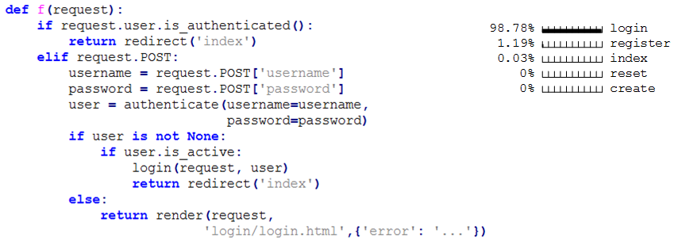

# Function Name Prediction

В проекте разработана модель нейронной сети для выполнения синтаксического анализа предложений языка программирования Python. Построено и обучено несколько моделей нейронных сетей выполняющих задачу определения названия функции по ее абстрактному синтаксическому дереву.

Результаты данного проекта отражены в научной статье ["ОБ ОПРЕДЕЛЕНИИ НАЗВАНИЯ ФУНКЦИИ ПО АБСТРАКТНОМУ СИНТАКСИЧЕСКОМУ ДЕРЕВУ С ПОМОЩЬЮ НЕЙРОННОЙ СЕТИ"](https://cyberleninka.ru/article/n/ob-opredelenii-nazvaniya-funktsii-po-abstraktnomu-sintaksicheskomu-derevu-s-pomoschyu-neyronnoy-seti).

[Ссылка на PDF.](https://cyberleninka.ru/article/n/ob-opredelenii-nazvaniya-funktsii-po-abstraktnomu-sintaksicheskomu-derevu-s-pomoschyu-neyronnoy-seti/pdf)

# Структура директории проекта

```
.
├── dataset						# Папка с информацией о датасете
├── extraction.ipynb			# Извлечение функций из датасета
├── functions_analysis.ipynb	# Анализ извлеченных функций и формирование
│								  датасета для обучения модели
├── train.ipynb					# Обучение модели
├── validate.ipynb				# Исследование обученной модели
├── dataset.py					# Функции для работы с датасетом
├── mycsv.py					# Функции для работы с .csv файлами
├── settings.py					# Конфигурационный файл
├── shortcuts.py				# Функции для работы с данными
├── transform.py				# Модуль для трансформации данных
└── README.md					# Данный файл
```
