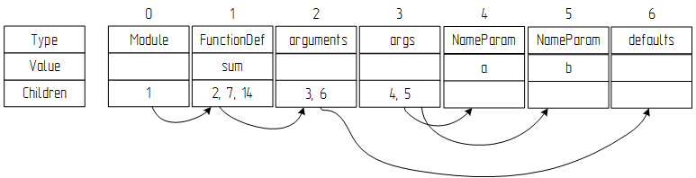

# Данные для обучения (датасет)

​	В задаче определения названия функции по абстрактному синтаксическому дереву (АСД) тела этой функции данными являются АСД тела функций, а метками названия функций. В результате подачи АСД тела функции в нейронную сеть, она выдает вероятностное распределение между названиями функций (массив значений вероятностей). То есть, с какой вероятностью подданная функция относится к каждому из названий. Выбирается название с большей вероятностью.

​	Перед обучением нейронной сети необходимо собрать данные для обучения, обработать их. Все действия выполняются с помощью языка Python. Используются версии Python 2 и 3 для выполнения разных задач. Построение моделей нейронных сетей и обучение выполняются при помощи популярных библиотек TensorFlow и Keras.

------

**Содержание**

1. [Описание исходных данных](#1-описание-исходных-данных)

   1.1. [Алгоритм прямого обхода дерева](#1-1-алгоритм-прямого-обхода-дерева)

   1.2. [Структура данных стартового датасета](#1-2-структура-данных-стартового-датасета)

2. [Преобразование датасета «Python ASTs»](#2-преобразование-датасета-python-asts)

   2.1. [Подготовка данных к фильтрации](#2-1-подготовка-данных-к-фильтрации)

   2.2. [Формирование словаря функций](#2-2-формирование-словаря-функций)

   2.3. [Формирование словаря значений](#2-3-формирование-словаря-значений)

   2.4. [Фильтрация данных](#2-4-фильтрация-данных)

​    [Реализация](#реализация)

------

# 1. Описание исходных данных

### 1.1. Алгоритм прямого обхода дерева

​	Обход дерева – это последовательное посещение всех элементов этого дерева ровно один раз. 

​	Существуют разные подходы к разработке алгоритмов обхода дерева: прямой обход, обход в ширину, центрированный обход, обратный обход и т.д. В работе используется алгоритм прямого обхода дерева, поэтому рассмотрим его (рисунок 1).


​          Рисунок 1 – Прямой обход дерева

Алгоритм прямого обхода:

Замечание: обход начинается с корня дерева.

1. Помечаем узел как посещенный.

2. Последовательно (от левого ребенка к правому) обходим все поддеревья рекурсивно прямым обходом.

На рисунке 1 применяется алгоритм прямого обхода к дереву. В итоге прямого обхода получается следующая последовательность посещенных узлов дерева (последовательность формируется по порядку посещения): F, B, A, D, C, E, G, I, H.

### 1.2. Структура данных стартового датасета

​	Данные для обучения были взяты из наборов данных [«Learning from Big Code»](http://learnbigcode.github.io/datasets/). Набор данных называется «Python ASTs». Он в себя включает 150 тысяч программ написанных на языке Python.

[Ссылка на скачивание датасета «Python ASTs» [526.6 MB]](http://files.srl.inf.ethz.ch/data/py150.tar.gz)

​	Каждая программа преобразована в последовательность узлов АСД дерева программы. К набору данных прилагается парсер, который может преобразовать исходный файл программы в последовательность узлов АСД.

На рисунке 2 изображено абстрактное синтаксическое дерево  следующей программы:

```python
def sum(a, b):
	return a+b
```


​          Рисунок 2 – Абстрактное синтаксическое дерево программы Python

​	Работа парсера заключается в следующем. Парсер имплементирует пакет «ast» стандартной библиотеки Python для преобразования исходного кода программы в абстрактное синтаксическое дерево (рисунок 2). Далее он обходит АСД с помощью алгоритма прямого обхода дерева, который рассмотрен в пункте 1. Каждое посещенный узел дерева добавляется в последовательность. Каждый узел несет информацию: тип узла, дети узла (если есть), значение узла (если есть). Таким образом, получается последовательность структур данных, где каждый элемент – это узел дерева.

​	Дерево содержит узлы двух типов: терминальные и нетерминальные. Терминальные узлы имеют поле value (значение) и не имеют детей. Структура начала последовательности приведена на рисунке 3. 



​          Рисунок 3 – Структура данных набора «Python ASTs»

# 2. Преобразование датасета «Python ASTs»

​	В задачах обучения нейронных сетей результат обучения модели очень сильно зависит от качества и количества данных. Перед тем как использовать данные для обучения, необходимо преобразовать данные таким образом, чтобы они были пригодны для отправки их в нейронную сеть. Также, следует извлечь признаки из данных, которые не влияют или мешают решению задачи. Иногда предположение о значимости признаков бывает ошибочным, поэтому уже на этом этапе окончательные решения могут приниматься по результатам экспериментов.

​	Данные из набора «Python ASTs» содержат только последовательность узлов АСД исходных кодов программ. Для решения задачи определения имени метода по АСД тела метода необходимо из всех последовательностей представляющих программы выбрать все подпоследовательности представляющие методы, и сопоставить с каждым методом метку (название этого метода). 

### 2.1. Подготовка данных к фильтрации

​	Исходный датасет хранится в `.json` файле. Где каждая строка представляет одну программу (АСД последовательность). Пример:

```python
[{"type":"Module","children":[1,4,6,34,55]},{"type": ... }]
```

​	Во-первых, необходимо загрузить модули из файла. Для этого используется стандартный модуль `json`.

​	Во-вторых, из набора программ необходимо составить набор функций. В программе может быть ноль, одна и больше функций. Перебирая узлы АСД последовательностей, находятся узлы типа «FunctionDef» (объявление функции) и находится последний ребенок этой функции. Выбирается подпоследовательность от узла объявления функции до последнего ребенка этой функции и добавляется в список функций, пометив данную подпоследовательность метой (название функции).

​	Данные для обучения должны представлять собой последовательность токенов, т.е. каждый узел АСД последовательности должен быть представлен в виде токена. АСД узел несет информацию о типе узла, о детях узла и о значении узла. Придётся пожертвовать некоторой информацией.

​	У каждого узла есть тип, но не у каждого есть дети или значение. Отбрасывается информацию о связях (детях) узлов, потому что непонятно как ее презентовать для нейросети в векторе. Остается информация двух типов, можно присвоить токену либо тип узла, либо значение узла. Типов узлов АСД мало, а уникальных значений узлов очень много. Маленькие словари для модели нейросети – это хорошо, потому что обучение проходит быстрее и тратится меньше памяти на хранение большого словаря. В данной задаче использование только типов узлов для определения имени метода недостаточно. А значения узлов могут многое сказать о назначении функции, поэтому их нельзя игнорировать. Но и все уникальные значения нельзя взять, потому что это будет огромный словарь, который будет занимать много памяти.

​	Решением будет – использовать информацию и о типах, и о значениях. Для этого необходимо для каждого узла решить: использовать тип узла для токена или значение. Для решения этой задачи будут формироваться словари.

### 2.2. Формирование словаря функций

​	Нейросетевая модель в работе решает задачу классификации, а точнее по АСД дереву функции, модель относит эту функцию к одному из классов. Классами являются названия функций. Чтобы нейросеть хорошо справлялась с задачей классификации, необходимо производить обучение с большим количеством примеров для каждого класса. Если будем мало примеров какой-нибудь функции, то нейросеть не сможет выучить зависимости характерные для данной функции и примеры этой функции будут классифицированы некорректно.

​	Первый шаг в формировании словаря это взять все названия функций из данных и посчитать для каждого названия функции, сколько раз это название функции встречается в данных (в метках, а не узлах). После этого получается большой словарь, который содержит все уникальные функции из данных.

​	Второй шаг – это выбрать порог вхождения функции в словарь по количеству пример функции. Все функции, которые ниже этого порога, отсекаются и не будут участвовать в обучении и тестах. Этот порог определяет качество и актуальность будущей модели. Если порог будет выбран очень большой, то получится мало различных функций, и модель будет классифицировать между маленьким количеством классов. Такая модель будет бесполезна. Если же выбрать маленький порог, то получится большое количество классов. У многих классов будет маленькое количество обучающих примеров, что негативно скажется на качестве модели. 

​	Выбор порога определяется размером набора данных, чем больше примеров функций с одинаковым названием, тем больше можно выбрать порог. С этим значением можно экспериментировать в небольшом диапазоне, подбирая оптимальное значение. Набор данных «Python ASTs» не очень большой. Порог выбран – 400. То есть функции, которые имеют менее 400 примеров, будут исключены из выборки. В результате отбора останется примерно 120-160 уникальных функций (классов).

​	Третий шаг заключается в исключении функций, которые сложно классифицировать. Существует ряд функций, структура которых во многих программах отличается. Например, если посмотреть на коды функций «setter», то все они очень похожи, поэтому их легко классифицировать. Но если сравнивать коды функций «main» или «run», то в большинстве программ они будут очень своеобразны. Поэтому на этом шаге исключается подобные функции из выборки. Также исключаются некоторые служебные функции и функции с названиями «f», «fo», «func» и т.д.

​	На четвертом шаге производится объединение в один класс некоторых классов. Некоторые названия функций в выборке одинаковы по смыслу, но имеют различные имена. Например, функции с именами «repr» и «str» выполняют одинаковую задачу, поэтому могут быть объединены в один класс «to_string». Также на этом шаге названия приводятся к нижнему регистру. Такие функции, как «setup» и «setUp» становятся одним классом. Это улучшит семантический подбор названий, но может не удовлетворить синтаксические требования. 

​	После выполнения всех шагов получается словарь названий функций, которые будут учувствовать в обучении. По этому словарю производится фильтрация всех функций. В выборке остаются только те функции, название которых присутствуют в словаре.

### 2.3. Формирование словаря значений

​	Многие узлы АСД имеют собственное значение. Значениями являются константы, имена идентификаторов, строки (комментарии), и т.д.

​	Значение может многое сказать о функции. Например, если в функцию подается аргумент с именем «file_name», а в самой функции используются методы «open», «readline», то сниппет с таким набором токенов можно классифицировать намного точнее, чем, если бы эти данные были неизвестны.

​	Значения дают дополнительную важную информацию, но уникальных значений очень много. Есть возможность использовать только часть значений. Для этого производится отбор значений, которые будут использоваться в качестве токенов в векторном представлении функций.

​	Для отбора значений формируется словарь уникальных значений со счётчиком для каждого значения, чтобы определить его частотность (по аналогии со словарем названий функций). Далее выбираются самые частотные значения. Самые частотные значения не являются самыми лучшими признаками, помогающими классифицировать. Большое количество частотных значений – нейтральные и не сильно влияют на принятие решения. Но такой способ не плох для отбора словаря значений, если нет возможности отобрать вручную или применить метод TF-IDF.

​	Также, следует подобрать размер словаря значений. Эта задача решается экспериментальным методом. Необходимо обучить модель с разным размером словаря, причём менять размер при экспериментах можно с большим разбросом.

### 2.4. Фильтрация данных

​	На предыдущих этапах были сформирован набор данных, который состоит их метки (названия функции) и векторного представления АСД этой функции. Каждый узел АСД хранит информацию о типе узла и значении узла (если есть).

​	На данном этапе узлы функций будут преобразованы в токены, путем выбора для каждого узла одного из двух возможных вариантов: использовать в качестве токена тип узла или значение узла.

​	Выбор производится при помощи сформированного словаря значений. На предыдущем этапе был сформирован словарь значений, в котором находятся все значения узлов, которые будут использоваться при обучении нейронной сети.

​	Процесс выбора следующий: последовательно посещаются все узлы всех функций и в каждом узле проверяется, есть ли у узла значение, если нет, тогда выбирается тип узла на место токена, если есть, то проверяется входит ли значение в словарь значений, если да, то берется значение узла за токен, если нет – тип узла.

​	Последним шагом подготовки данных является удаление первого элемента векторов токенов, который несет информацию о названии функции. После этого имеется набор данных, имеющий следующую структуру: метка (название функции/класс) и сопоставленный с ней вектор токенов.

Пример одной функции:

```python
[ delete, # метка (название функции)
  ['arguments', 'args', 'self', 'name', ...] # последовательность токенов
]
```

# Реализация

Преобразование датасета «Python ASTs» к финальному датасету производится в:

* `extraction.ipynb` – извлечение функций из датасета «Python ASTs»
* `functions_analysis.ipynb `– формирование словарей, отбор функций, преобразование узлов и сохранение финального датасета