------

**Содержание**

[1. Обучение и улучшение моделей нейронных сетей](#1-обучение-и-улучшение-моделей-нейронных-сетей)

​	[1.1. Обучение моделей](#1.1-обучение-моделей)

​	[1.2. Улучшение модели](#1.2-улучшение-модели)

[2. Подготовка набора данных](#2-подготовка-набора-данных)

[3. Экспериментирование и исследование](#3-экспериментирование-и-исследование)

​	[3.1. Экспериментирование с датасетами](#3.1-экспериментирование-с-датасетами)

​		[3.1.1. Convolution Neural Network](#3.1.1-convolution-neural-network)

​		[3.1.2. Long Short Term Memory](#3.1.2-long -short-term-memory)

​		[3.1.3. Сравнение обученных моделей](#3.1.3-сравнение-обученных-моделей)

​		[3.1.4. Вывод по разделу](#3.1.4-вывод-по-разделу)

​	[3.2 Экспериментирование с моделями](#3.2-экспериментирование-с-моделями)

​		[3.2.1. Краткое описание исходных моделей](#3.2.1-краткое-описание-исходных-моделей)

​			[3.2.1.1.  Convolution Neural Network](#3.2.1.1-convolution-neural-network)

​			[3.2.1.2.  Long Short Term Memory](#3.2.1.2-long-short-term-memory)

​			[3.2.1.3. Компиляция](#3.2.1.3-компиляция)

​		[3.2.2. Изменение моделей](#3.2.2-изменение-моделей)

​	[3.3. Исследование коллизий в датасете](#3.3-исследование-коллизий-в-датасете)

​		[3.3.1. Удаление плохих функций](#3.3.1-удаление-плохих-функций)

​		[3.3.2. Объединение похожих функций](#3.3.2-объединение-похожих-функций)

​		[3.3.3. Результат раздела](#3.3.3-результат-раздела)

[4. Реализация](#4-реализация)

[5. Результаты](#5-результаты)

------


# 1. Обучение и улучшение моделей нейронных сетей

​	Модель задается большим количеством параметров, поэтому можно построить множество разных моделей. Сложно заранее определить какая архитектура модели будет справляться с задачей лучше. При построении модели следует учитывать тип решаемой задачи и опираться на известные практики. Добившись внушительных результатов, можно начать экспериментировать для получения лучших результатов.

​	На последующих этапах обработки и подготовки данных к обучению, всегда будет формироваться пара наборов. Один набор является обучающим, второй набор тестовым. Такое деление наборов необходимо для проверки того, как нейросеть справляется с примерами, которые она не наблюдала при обучении. Такой подход применяется потому, что нейросеть имеет свойство переобучаться и выдавать результат лучше на тех данных, на которых она учиться.

​	Точность работы модели определяется по тому, правильно ли она определяет метки примеров тестовой выборки, т.е. тех примеров, которых нейросеть не видела при обучении. **Точность** модели показывает, с какой вероятностью модель определяет правильную метку для примера данных. Именно такая точность является качественным показателем модели, чем больше эта точность, тем модель лучше.


## 1.1. Обучение моделей

​	На предыдущем этапе были построены две модели нейронных сетей. В основе одной лежит – Convolution Neural Network, второй – Long Short Term Memory модели. Для каждой модели уже определены первый и последний слои, которые не подлежат изменению. Первый слой является слоем Embedding, а последний слой полносвязный. С остальными слоями можно проводить эксперименты. Подробное описание начальных моделей приведено в файле `model_architecture.md`.

​	Сначала проводится обучение начальных моделей на нескольких сформированных датасетах для того, чтобы задать отправную точку дальнейшим экспериментам.


## 1.2. Улучшение модели

​	Улучшения модели должны быть направлены на увеличение точности работы, при как можно большем количестве классов. В проекте ориентировочные показатели такие: точность модели 80+%, количество классов 100+, общий размер модели и словарей не более 15 МБ.

​	Конечная нейронная сеть будет получена, после прохождения определенных этапов. Этапы направленны на исследование модели, набора данных и их улучшения.

​	**Этапы работы с моделью:**

1. Экспериментирование с датасетами.

   *Цель: выявить наиболее подходящие параметры датасета (количество токенов, длина последовательности).*

2. Экспериментирование с моделью.

   *Цель: усовершенствовать модель, меняя ее параметры (слои, функцию потерь, оптимизатор и т.д.).*

3. Исследование коллизий в датасете и их исправление.

   *Цель: главная задача выявить помехи в данных и устранить их.*


В любое время при необходимости, можно возвращаться и повторять некоторые шаги.

​	После обучения и улучшения модели, должна быть получена конечная модель, которая справляется с распознаванием имен функций по сниппету кода успешно с вероятностью 80+%, при 100+ распознаваемых классов. Если была попытка угадать функцию, не входящую в распознаваемые классы, тогда результат предсказания не влияет на точность.

​	

​	Все этапы подготовки данных для обучения производятся с помощью языка программирования Python в среде Google Colab. В подготовке данных используется стандартные библиотеки Python 3 и возможности Python 2.

​	Построение моделей производится тоже при помощи языка Python. Для этого используются две популярные библиотеки для работы с нейронными сетями: библиотека TensorFlow и библиотека Keras (является надстройкой над TensorFlow и еще несколькими библиотеками).

​	

# 2. Подготовка набора данных

​	Постобработка определяет некоторые параметры обучения, а точнее количество классов для классификации и размер словаря токенов. С этими параметрами можно экспериментировать, чтобы подобрать оптимальные значения.
​	Поэтому извлеченный набор данных из «Python ASTs» обрабатывается с разными параметрами несколько раз. В итоге получается несколько наборов данных для обучения с разными параметрами, которые указаны в таблице 2. Из параметров изменяется размер словаря токенов и порог вхождения функции в выборку. При увеличении словаря токенов, при отборе признаков, в последовательность будут попадать больше уникальных значений, а при уменьшении наоборот. При увеличении порога, количество классов будет сокращаться, а при уменьшении наоборот.

**Изменяемые параметры:**

* Порог вхождения уникального значения узла в выборку (токена) 
* Порог вхождения названия функции в выборку (класса)

​	Параметры начального датасета отражены в таблице 1.

Таблица 1 – **Параметры датасета**

|              Параметр               | Значение |
| :---------------------------------: | :------: |
|      Общее количество функций       | 1274485  |
|  Уникальных имен функций (классов)  |  535819  |
| Уникальных значений узлов (токенов) | 2437048  |

Таблица 2 – **Сформированные наборы данных для обучения**

| №    | Порог вхождения токена в выборку | Порог вхождения функции в выборку | Количество функций для обучения | Количество токенов | Количество классов |
| ---- | :------------------------------: | :-------------------------------: | :-----------------------------: | :----------------: | :----------------: |
| 0    |              20000               |                400                |             155501              |        136         |        101         |
| 1    |              15000               |                300                |             183021              |        234         |        175         |
| 2    |              15000               |                200                |             200912              |        234         |        247         |
| 3    |               9000               |                300                |             182834              |        379         |        175         |
| 4    |               9000               |                200                |             200710              |        379         |        247         |
| 5    |               2000               |                300                |             182834              |        1498        |        175         |
| 6    |               2000               |                200                |             200912              |        1498        |        247         |
| 7    |               1000               |                400                |             165663              |        2653        |        125         |
| 8    |               250                |                420                |             159790              |        8430        |        113         |

В итоге получилось 9 наборов данных с различными параметрами. Каждый набор пронумерован и далее обращение к наборам данных будет производиться по их номеру.

Notebook реализующий формирование датасетов: `functions_analysis.ipynb`


# 3. Экспериментирование и исследование

​	Этот раздел отражает ход экспериментов с моделями и данными и их исследование, а также изменения датасетов и самих моделей.


## 3.1. Экспериментирование с датасетами

​	На данном этапе будет производиться обучение моделей нейронных сетей на разных датасетах, подготовленных на предыдущем этапе. Замер их эффективности в зависимости от данных. И выбор лучшего набора данных. Обучение заканчивается, когда модель несколько эпох не улучшается или происходит переобучение.

**Изменяемые параметры:**

* Набор данных
* Длина последовательности
* Количество эпох

*Цель: выявить наиболее подходящие параметры датасета (количество токенов, длина последовательности).*

### 3.1.1. Convolution Neural Network

​		Первая модель построена на основе сверточных слоев. Будем называть модели сочетанием аббревиатур используемых в них слоев. Первую модель назовем CNN (Convolution Neural Network). Помимо входного, выходного и сверточных слоев в модели присутствуют слои пулинга и слой прореживания. Структурная схема на рисунке 1. Результаты обучения модели отражены в таблице 3.


​		Рисунок 1 – Структурная схема модели CNN

​	Результаты обучения модели отражены в таблице 5.

Таблица 3 – **Результаты обучения модели CNN**

|  №   | Набор данных, <br>[номер (количество классов)] | Длина последовательности | Количество эпох | Точность,<br> % | Время обучения,<br>сек |
| :--: | :--------------------------------------------: | :----------------------: | :-------------: | :-------------: | :--------------------: |
|  1   |                    0 (101)                     |           200            |       20        |     65.1307     |          340           |
|  2   |                    1 (175)                     |           200            |       25        |     62.8063     |          500           |
|  3   |                    2 (247)                     |           200            |       20        |     59.8641     |          440           |
|  4   |                    3 (175)                     |           200            |       20        |     64.5371     |          400           |
|  5   |                    4 (247)                     |           200            |       20        |     61.3577     |          540           |
|  6   |                    5 (175)                     |           200            |       20        |     67.0216     |          500           |
|  7   |                    6 (247)                     |           200            |       20        |     64.2987     |          560           |
|  8   |                    7 (132)                     |           200            |       20        |     69.5763     |          460           |
|  9   |                    7 (132)                     |           100            |       20        |     68.8266     |          360           |
|  10  |                    7 (132)                     |           300            |       20        |     69.6486     |          660           |
|  11  |                    8 (113)                     |           250            |       20        |     69.9446     |          580           |

​	График обучения показывает зависимость доли правильных ответов от количества эпох обучения. Синяя кривая относится к обучающей выборке, а оранжевая к тестовой выборке. Интерес представляет показатели тестовой выборки. По тестовой выборке определяется точность модели. А синяя кривая выводится для того, чтобы засвидетельствовать переобучение модели. Когда разница показателей синей кривой и оранжевой становится большой — это можно назвать переобучением.

​	Графики обучения нумеруются в соответствии с табличными данными (таблица 3, №).

Графики обучения:

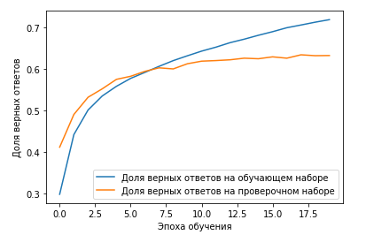Рисунок 2.1 – График обучения CNN модели №1

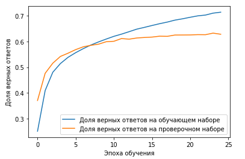 Рисунок 2.2 – График обучения CNN модели №2

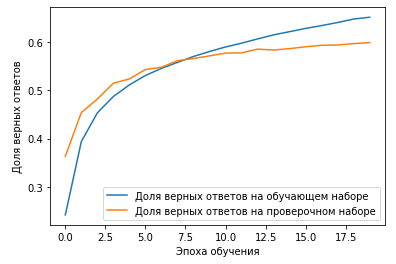 Рисунок 2.3 – График обучения CNN модели №3

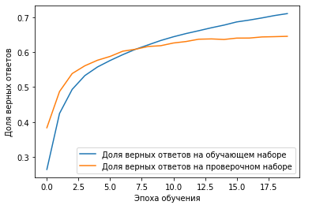 Рисунок 2.4 – График обучения CNN модели №4

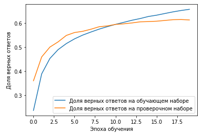 Рисунок 2.5 – График обучения CNN модели №5

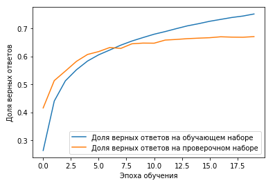 Рисунок 2.6 – График обучения CNN модели №6

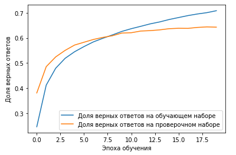 Рисунок 2.7 – График обучения CNN модели №7

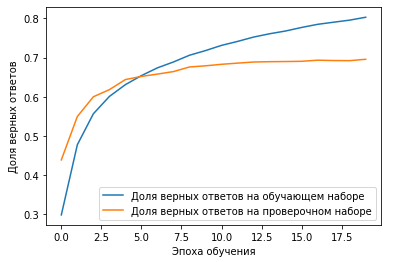 Рисунок 2.8 – График обучения CNN модели №8

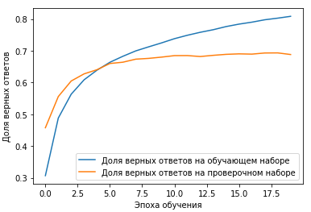 Рисунок 2.9 – График обучения CNN модели №9

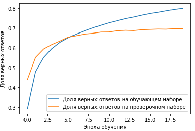 Рисунок 2.10 – График обучения CNN модели №10

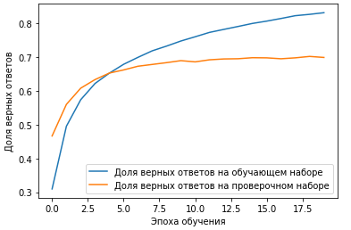  Рисунок 2.11 – График обучения CNN модели №11

**Наблюдения (для первых 10-ти обучений):**

* Среднее количество эпох до переобучения 20.5. Графики обучения придерживаются единой тенденции.

* Среднее значение точности 65,30677 %.

* Среднее значение времени обучения 476 секунд.

* Длина последовательности влияет не сильно. При увеличении длинны, растет точность.

* Увеличение количества токенов повышает точность.

* Увеличение количества классов понижает точность.

  

После произведенных наблюдений, выявлены оптимальные параметры датасета и произведены дополнительные формирования датасетов и обучение (датасет в таблице 2 - №8 и обучение в таблице 3 - №11). По результатам, сформированный датасет выдает лучший результат, который отражен в таблице 4.

Таблица 4 – **Лучший результат модели CNN**

| Параметр                           | Значение |
| ---------------------------------- | -------- |
| Набор данных                       | 8        |
| Количество классов                 | 113      |
| Количество токенов                 | 8430     |
| Длинна последовательности          | 250      |
| Размер словаря, Кбайт              | 139.18   |
| Размер модели, Мбайт               | 9.56     |
| Выполнено эпох обучения            | 20       |
| Затрачено времени на обучение, сек | 580      |
| Точность модели, %                 | 69.9446  |


### 3.1.2. Long Short Term Memory

​		Вторая модель построена на основе LSTM (Long Short Term Memory) слоев. LSTM являются модификацией рекуррентных слоев. Нейрон LSTM имеет более сложную структуру, которая лучше справляется с затуханием информации при обработке длинных последовательностей. Результаты обучения приведены в таблице 5. Структурная схема изображена на рисунке 2.


​		Рисунок 2 – Структурная схема модели CNN

​	Результаты обучения модели отражены в таблице 5.

Таблица 5 – **Результаты обучения модели LSTM**

|  №   | Набор данных, <br>[номер (количество классов)] | Длина последовательности | Количество эпох | Точность,<br> % | Время обучения,<br> сек |
| :--: | :--------------------------------------------: | :----------------------: | :-------------: | :-------------: | :---------------------: |
|  1   |                    0 (101)                     |           200            |       20        |     63.7512     |           840           |
|  2   |                    1 (175)                     |           200            |       30        |     63.2598     |          1470           |
|  3   |                    2 (247)                     |           200            |       25        |     60.2474     |          1350           |
|  4   |                    3 (175)                     |           200            |       25        |     64.6137     |          1225           |
|  5   |                    4 (247)                     |           200            |       20        |     61.2656     |          1040           |
|  6   |                    5 (175)                     |           200            |       25        |     67.251      |          1200           |
|  7   |                    6 (247)                     |           200            |       20        |     63.9381     |          1060           |
|  8   |                    7 (132)                     |           200            |       20        |     69.8534     |           880           |
|  9   |                    7 (132)                     |           100            |       20        |     69.9648     |           520           |
|  10  |                    7 (132)                     |           300            |       20        |     70.2689     |          1280           |
|  11  |                    8 (113)                     |           250            |       20        |     71.7494     |          1060           |

​	Графики обучения нумеруются в соответствии с табличными данными (таблица 5, №).

Графики обучения:

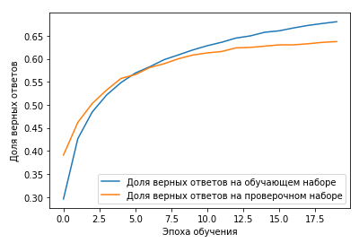  Рисунок 3.1 – График обучения LSTM модели №1

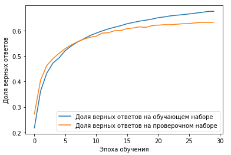  Рисунок 3.2 – График обучения LSTM модели №2

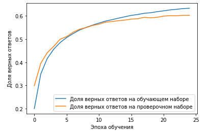 Рисунок 3.3 – График обучения LSTM модели №3

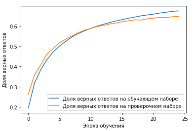 Рисунок 3.4 – График обучения LSTM модели №4

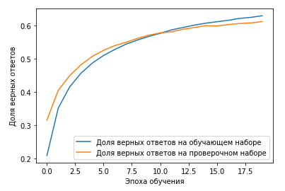 Рисунок 3.5 – График обучения LSTM модели №5


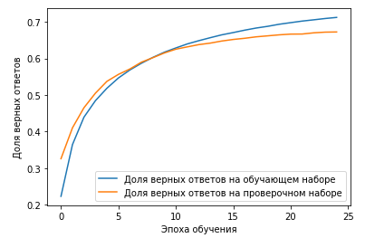  Рисунок 3.6 – График обучения LSTM модели №6

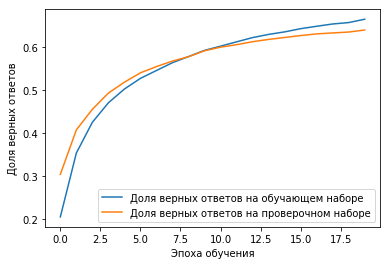  Рисунок 3.7 – График обучения LSTM модели №7

 Рисунок 3.8 – График обучения LSTM модели №8

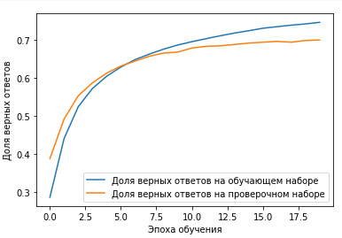 Рисунок 3.9 – График обучения LSTM модели №9

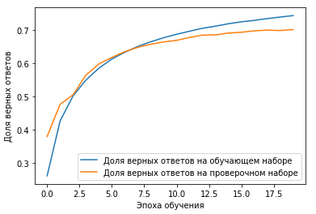 Рисунок 3.10 – График обучения LSTM модели №10

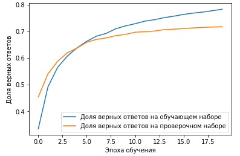 Рисунок 3.11 – График обучения LSTM модели №11

**Наблюдения (для первых 10-ти обучений):**

* Среднее количество эпох до переобучения 22.5. Графики обучения придерживаются единой тенденции.
* Среднее значение точности 65,44139 %.
* Среднее значение времени обучения 1086,5 секунд.
* Длина последовательности влияет не сильно. При увеличении длинны, точность может как расти, так и падать.
* Увеличение количества токенов повышает точность.
* Увеличение количества классов понижает точность.

После произведенных наблюдений, выявлены оптимальные параметры датасета и произведены дополнительные формирования датасетов и обучение (датасет в таблице 2 - №8 и обучение в таблице 5 - №11). По результатам, сформированный датасет выдает лучший результат, который отражен в таблице 6.

Таблица 6 – **Лучший результат модели LSTM**

| Параметр                           | Значение |
| ---------------------------------- | -------- |
| Набор данных                       | 8        |
| Количество классов                 | 113      |
| Количество токенов                 | 8430     |
| Длинна последовательности          | 250      |
| Размер словаря, Кбайт              | 139.18   |
| Размер модели, Мбайт               | 5.67     |
| Выполнено эпох обучения            | 20       |
| Затрачено времени на обучение, сек | 1060     |
| Точность модели, %                 | 71.7494  |


### 3.1.3. Сравнение обученных моделей

​	Модели сравниваются по нескольким параметрам, но главные параметры — это точность модели и количество распознаваемых функций (классов). Выбирается самая точная модель и сравнивается со второй моделью, обученной на том же датасете, что и выбранная.

Таблица 7 – **Сравнение лучших результатов моделей**

| Параметр              | CNN     | LSTM    | Разность,<br>\|LSTM-CNN\| |
| --------------------- | ------- | ------- | ------------------------- |
| Точность, %           | 69.9446 | 71.7494 | 1.8048                    |
| Время обучения, сек   | 580     | 1060    | 480                       |
| Размер модели, Мбайт  | 9.56    | 5.67    | 3.89                      |
| Размер словаря, Кбайт | 139.18  | 139.18  | 0                         |
| Реальные примеры      | -       | -       | -                         |

**Точность**: точность модели LSTM превосходит точность модели CNN на 1,8048 %. Разница не великая.
**Время обучения**: Модель LSTM учится примерно в 2 раза дольше модели CNN. Так как вычисления в сверточных слоях можно распараллелить и выполнять на видеокарте, то сверточные слои тратят меньше времени на обучение. Слои же рекуррентные не поддаются распараллеливанию, потому что имеют обратную связь в нейронах, которая не известна заранее, а рассчитывается во время чтения последовательности. 
**Размер модели**: размер модели LSTM меньше, чем CNN на 3.89 Мбайт. Размер зависит от: размера словаря токенов, так как матрица Embedding хранится в модели; от количества внутренних параметров модели, которые являются внутренним состоянием. У LSTM модели таких параметров меньше.
**Реальные примеры**: -
**Вывод:** модель на основе рекуррентных слоев (LSTM) является успешней в точности, чем модель на основе сверточных слоев (CNN). Она выдает большую точность классификации равную 71.7494 %, меньше переобучается и имеет меньший размер. Но LSTM учится долго. В 2 раза дольше, чтобы достигнуть уровень CNN. Поэтому, если необходимо более быстрое решение и можно пожертвовать точностью, то следует применить сверточные сети. А если точность важнее – использовать LSTM.

Таблица 8 – **Сравнение средних результатов моделей**

| Параметр              | CNN      | LSTM     | Разность<br>\|LSTM-CNN\| |
| --------------------- | -------- | -------- | ------------------------ |
| Точность, %           | 65.72839 | 66.01485 | 0.28646                  |
| Время обучения, сек   | 485.4545 | 1084.091 | 599.6365                 |
| Размер модели, Мбайт  | 7.352222 | 3.445556 | 3.906662                 |
| Размер словаря, Кбайт | 33.08444 | 33.08444 | 0                        |

​	Сравнение средних результатов, показывает, что точность почти одинаковая. Хотя, по лучшим результатам разница больше в несколько раз. Это может говорить о том, что набор для обучения более пригоден для LSTM моделей.

​	Разность остальных параметров схожа с разностью лучших результатов.


### 3.1.4. Вывод по разделу

​	В ходе экспериментов с датасетами, были выявлены некоторые зависимости точности модели от параметров датасетов. В результате был сформирован дополнительный оптимальный датасет (№8, таблица 2), который обеспечил лучшую точность работы моделей.

​	Лучшую точность определения названия функции по ее абстрактному синтаксическому дереву выдала модель, основанная на LSTM модели. Точность составляет - 71.75 %.

​	В экспериментах использовались начальные модели нейронных сетей, и параметры компилятора или модели не менялись.


## 3.2 Экспериментирование с моделями

​	На данном этапе уже имеется датасет с оптимальными параметрами и две начальные модели нейронных сетей. Задача экспериментов с моделями заключается в подборе гиперпараметров нейронной сети, которые обеспечат увеличение точности модели. Также может меняться длинна последовательности токенов (изменение параметра датасета), т.к. модели могут работать оптимальнее с определенной длинной последовательности.

### 3.2.1. Краткое описание исходных моделей

​	На исходных моделях проиходили происходили из раздела 3.1. Во время проведения экспериментов никакие параметры нейронных сетей не менялись.

#### 3.2.1.1.  Convolution Neural Network

​		Первая модель построена на основе сверточных слоев. Помимо входного, выходного и сверточных слоев в модели присутствуют слои пулинга и слой прореживания. В библиотеке Keras сверточный слой называется Conv1D, полносвязный – Dense, а прореживание – Dropout. Программную реализацию модели можно увидеть в листинге 1.1.

```python
# CNN-Model
model_name = 'fnp_cnn'
model = Sequential()
model.add(Embedding(len(data_converter), 32, input_length=maxlen))
model.add(Conv1D(100, 10, activation='relu', padding='same'))
model.add(Conv1D(100, 10, activation='relu', padding='same'))
model.add(MaxPooling1D(3))
model.add(Conv1D(160, 10, activation='relu', padding='same'))
model.add(Conv1D(160, 10, activation='relu', padding='same'))
model.add(GlobalAveragePooling1D())
model.add(Dropout(0.5))
model.add(Dense(len(marks_converter), activation='softmax'))
```

​		Листинг 1.1 – Программная реализация модели CNN

#### 3.2.1.2.  Long Short Term Memory

​		Вторая модель построена на основе LSTM (Long Short Term Memory) слоев. Программная реализация модели приведена в листинге 1.2.

```python
# LSTM-Model
model_name = 'fnp_lstm'
model = Sequential()
model.add(Embedding(len(data_converter), 32, input_length=maxlen))
model.add(LSTM(128, return_sequences=True, dropout=0.2))
model.add(LSTM(128, dropout=0.2))
model.add(Dense(len(marks_converter), activation='softmax'))
```

​		Листинг 1.2 – Программная реализация модели LSTM

#### 3.2.1.3. Компиляция

​	Помимо построения модели, модель необходимо скомпилировать. При компиляции задаются важные параметры, такие как: 

- *Функция потерь (Loss function)* — измеряет точность модели во время обучения. Мы хотим минимизировать эту функцию чтоб "направить" модель в верном направлении.
- *Оптимизатор (Optimizer)* — показывает каким образом обновляется модель на основе входных данных и функции потерь.
- *Метрики (Metrics)* — используются для мониторинга тренировки и тестирования модели. Наш пример использует метрику *accuracy* равную доле правильно классифицированных изображений.

```python
model.compile(
    optimizer='adam',
    loss='categorical_crossentropy',
    metrics=['accuracy']
)
```

​		Листинг 2 – Программная реализация компиляции модели

​	Для обеих исходных моделей использовалась указанная в листинге 2 компиляция.

### 3.2.2. Изменение моделей

​	В этом разделе описываются эксперименты с моделью. Производится изменение гиперпараметров модели до тех пор, пока не улучшится точность модели. Успешно измененные модели и результаты заносятся в этот отчет.

**Модель №1 (Bi-LSTM)**

```python
# Bi-LSTM-Model
model_name = 'fnp_bilstm'
model = Sequential()
model.add(Embedding(len(data_converter), 64, input_length=maxlen))
model.add(Bidirectional(LSTM(128, return_sequences=True, dropout=0.3)))
model.add(Bidirectional(LSTM(128, dropout=0.3)))
model.add(Dense(len(marks_converter), activation='softmax'))
```

Листинг 3.1 – Программная реализация модели

*Комментарий:* после перестройки исходной модели LSTM получилась модель Bi-LSTM. В новой модели увеличен размер Embedding'а в 2 раза. Теперь размер Embedding'а равен 64. Также вместо обычных LSTM слоев используются двунаправленные слои LSTM. У слоев увеличен Dropout до значения равного 0.3. В остальном модель сохраняет исходную конфигурацию с исходными параметрами компиляции.

Таблица 9 – **Таблица результатов обучения после изменения модели** 

| Номер модели | Набор данных | Длина последовательности | Время обучения,<br>(количество эпох;<br> время обучения [сек]) | Точность, <br>% |
| :----------: | :----------: | :----------------------: | :----------------------------------------------------------: | :-------------: |
|      1       |      8       |           300            |                           20; 1700                           |     72.669      |


Большое количество попыток улучшить модель закончились неудачей. Перебить результат исходных моделей смогла только Модель №1 (Bi-LSTM), и то только на 0.9196 процента. В дополнение модель увеличила свой размер и время обучения.


## 3.3. Исследование коллизий в датасете

​	К данному этапу готовы оптимальный набор данных и оптимальная модель нейронной сети, которые были получены на предыдущих этапах. На этом этапе производиться анализ модели и данных. Алгоритм анализа прост: поиск частой ошибки модели и поиск причины, с целью дальнейшего устранения.

​	Первый прием — удалить из набора плохие функции для модели. Плохая функция — это функция, код которой малопредсказуем. Т.е. от программы к программе функция может содержать совершенно непохожий код. Например, функция `__main__()`, или что еще лучше: функции `foo`, `func`, `fn`. От такого рода функций следует избавиться. Удаление функций происходит на этапе формирования датасета.

​	Второй прием — объединить метки функций, код которых очень похож и выполняет одинаковую задачу. На практике этот прием должен дать значительный прирост точности, т.к. это одни из самых частотных ошибок модели. Этот прием можно использовать после обучения модели, анализируя предсказания модели.

​	Для начала можно обойтись двумя способами улучшения модели. Цель точности модели равно 80%. Осталось набрать недостающих 7.31%.

### 3.3.1. Удаление плохих функций

​	Удалений функций со сложно классифицируемым сниппетом производиться при формировании датасета. При формировании исходных датасетов из таблицы 2, этот подход учитывался, и были удалены несколько очевидно не подходящих имен функций. В разделе исследуется тестовая выборка, которая не учувствовала в обучении.

**Исследование.**

​	Пример — один экземпляр датасета, представляющий одну функцию.

​	Правильное название функции — это то, как называется функция. Предсказанное название — это название, которому нейронная сеть дает наибольшую вероятность. Если предсказанное название и правильное название совпадают, значит модель определила название верно (и наоборот).

Поиск плохих функций:

1. Посчитать количество функций для каждого имени.
2. Сложить вероятности правильного названия функции для каждого имени.
3. Поделить сумму вероятностей на количество функций для каждого имени.
4. Проанализировать самые маленьки получившиеся значения. Самые малые значения получились у функций, с которыми модель справляется плохо. Среди них стоит искать плохие функции.

**Решение.**

​	Удаление функций из датасета.


### 3.3.2. Объединение похожих функций

​	Объединение похожих функций при формировании исходных датасетов не проводилось. Когда имеется обученная модель, можно быстрее определить похожие функции. В разделе исследуется тестовая выборка, которая не учувствовала в обучении.

**Исследование.**

​	Для поиска похожих функций производились следующие действия:

1. Для каждого примера было сделано предсказание из которого можно извлечь данные такие, как: значение вероятности правильного названия функции, значение вероятности предсказанного названия функции, и строковые названия правильной и предсказанной функции.

2. Примеры разделяются на две категории:

   ​	1) модель определила название функции правильно,

   ​	2) модель определила название  функции неверно.

   Далее берется вторая категория.

3. Сопоставляются вероятность правильного названия и вероятность предсказанного. Далее отбираются только те примеры, где вероятность правильного и вероятность предсказанного выше 40% (не в сумме). Это означает, что модель сомневалась между двумя главными вариантами.

4. Вручную выбираются похожие функции, используя знания языка и посчитанной статистики. Особое внимание уделяется очень частой ошибке и взаимной ошибке (когда два названия функции во многих примерах меняются местами с правильного предсказания и предсказанного.)

**Решение.**

​	После поиска похожих функций следует их объединить. Для этого берется множество похожих названий и приводится к одному общему. И в процессе формирования нового датасета названия похожих функций заменяется на общее название.

*Примечание: названия функций объединяется только в случае, если они логически похожи, а не просто на основе статистики.*

### 3.3.3. Результат раздела

​	После поиска коллизий, в датасете они исправляются  и формируется новый датасет. Затем производится обучение лучшей модели на новом датасете. Результат отражен в таблице 10. 

Таблица 10 – **Таблица результатов обучения после исправления коллизий**

| Параметр                                       | Значение |
| ---------------------------------------------- | -------- |
| Модель                                         | Bi-LSTM  |
| Количество классов                             | 107      |
| Длинна последовательности                      | 250      |
| Время обучения, (количество эпох; время в сек) | 25; 3100 |
| Точность, %                                    | 79.1374  |

​	Ориентировочные показатели проекта были следующие:

* Количество классов  – 100+;
* Точность  – 80+%;
* Размер модели до 15 Мбайт.

Обученная модель не удовлетворяет заданным параметрам.


# 4. Реализация

1. Все датасеты готовятся в `analysis.ipynb`.
2. Все модели строятся, модифицируются и обучаются в `train.ipynb`.
3. Исследование коллизий датасета и обученной модели производится в `research.ipynb`.
4. Требуемые функции для выполнения notebook'ов в папке `core`.


# 5. Результаты

​	В данном проекте решалась задача определения названия функции по абстрактному синтаксическому дереву ее тела. Задача решалась для языка программирования Python. Для решения этой задачи были построены несколько вариантов глубоких нейронных сетей, две лучшие были выбраны для экспериментирования. После экспериментов модели были улучшены. Точнее всего справилась модель нейронной сети, основанная на двунаправленных рекуррентных слоях. Эта модель правильно определяет название функций, которые не учувствовали в обучении, с вероятностью 79.14%. Ожидается, что на большем наборе данных точность рекуррентной модели будет заметно больше.

​	Также, в работе использовалась модель на основе сверточных слоев. Эта модель немного уступает в точности, имеет больший размер. Но при этом быстрее учиться и быстрее делает предсказания.

