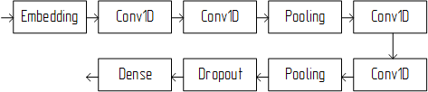
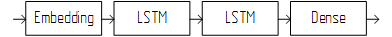

# Общая архитектура модели

​		Общая архитектура модели включает в себя модель нейронной сети и все модули подготовки данных для обучения или предсказания.

------

**Содержание**

1. [Обзор общей архитектуры модели](#1-обзор-общей-архитектуры-модели)

2. [Архитектура нейронной сети](#2-архитектура-нейронных-сетей)

   2.1.  [Convolution Neural Network](#2.1-convolution-neural-network)

   2.2.  [Long Short Term Memory](#22-long-short-term-memory)

​    [Реализация](#реализация)

------

​		Архитектура модели – это структура модели нейронной сети, то из каких слоев состоит модель, то, как слои соединены.

​		В работе используется последовательная архитектура модели. Это значит, что слои соединены друг за другом.

​		Модель нейронной сети в работе решает задачу классификации. Модель получает на вход последовательность токенов и выдает вероятностное распределение классов, где каждый класс является названием функции. Таким образом, нейросеть определяет, с какой вероятностью последовательность токенов относится к  каждому из классов.

​		В качестве данных для обучения используется последовательности токенов, где важен порядок токенов, и токены имеют зависимости. Поэтому неэффективно использовать легкие подходы представления последовательностей методом «мешка слов» и использовать только полносвязные слои в модели. Для решения этой задачи больше подходят рекуррентные нейронные сети или сверточные нейронные сети, потому что они учитывают связи между токенами.

​		Первым слоем модели нейронной сети выбран Embedding, потому что он работает с последовательностями, нормализует данные и подходит и для рекуррентных сетей, и для сверточных сетей. 

​		Последний слой – полносвязный слой, у которого количество нейронов равно количеству определяемых классов (названий функций). На выходе этого слоя выдается вектор распределения вероятностей каждого класса.

​	 Выбор промежуточных слоев рассматривается после обзора общей архитектуры модели.

## 1. Обзор общей архитектуры модели

Общая модель изображена на рисунке 1.


​			Рисунок 1 – Общая архитектура модели

​		На рисунке 1 в перых двух блоках *Парсер* и *Программный модуль обработки данных* происходит подготовка данных перед подачей их в нейронную сеть. Подробно процесс обработки описан в `docs/data_preparation.md` в главе 2. В последнем блоке *Модель нейронной сети* определены два слоя – первый и последний. В промежуточных слоях будут учавствовать два варианта последовательности слоев. Варианты описаны в следующей главе.

## 2. Архитектура нейронных сетей

​		Модель задается большим количеством параметров, поэтому можно построить множество разных моделей. Сложно заранее определить какая архитектура модели будет справляться с задачей лучше. При построении модели следует учитывать тип решаемой задачи и опираться на известные практики. Добившись внушительных результатов можно начать экспериментировать для получения лучших результатов.

​		Для модели уже определены первый и последний слои. Первый слой является слоем Embedding, а последний слой полносвязный.

​		Все этапы подготовки данных для обучения производятся с помощью языка программирования Python в среде Google Colab. В подготовке данных используется стандартные библиотеки Python 3 и возможности Python 2.

​		Построение моделей производится тоже при помощи языка Python. Для этого используются две популярные библиотеки для работы с нейронными сетями: библиотека TensorFlow и библиотека Keras (является надстройкой над TensorFlow и еще несколькими библиотеками).

​		Десяток моделей был построен при помощи большого количества микро-экспериментов – обучение на маленьком количестве эпох. Строилась модель, и сравнивалась точность модели при изменениях её параметров. Модели строились на основе предыдущего опыта решения задач в области обработки естественных языков. Но делались также большие отклонения от устоявшихся подходов. После микро-экспериментов было выбрано две лучшие модели, которые рассмотрены далее.

### 2.1.  Convolution Neural Network

​		Первая модель построена на основе сверточных слоев. Будем называть модели сочетанием аббревиатур используемых в них слоев. Первую модель назовем CNN (Convolution Neural Network). Помимо входного, выходного и сверточных слоев в модели присутствуют слои пулинга и слой прореживания. В библиотеке Keras сверточный слой называется Conv1D, полносвязный – Dense, а прореживание – Dropout. Программную реализацию модели можно увидеть в листинге 1. Структурная схема на рисунке 2.

```python
# CNN-Model
model_name = 'fnp_cnn'
model = Sequential()
model.add(Embedding(len(data_converter), 32, input_length=maxlen))
model.add(Conv1D(100, 10, activation='relu', padding='same'))
model.add(Conv1D(100, 10, activation='relu', padding='same'))
model.add(MaxPooling1D(3))
model.add(Conv1D(160, 10, activation='relu', padding='same'))
model.add(Conv1D(160, 10, activation='relu', padding='same'))
model.add(GlobalAveragePooling1D())
model.add(Dropout(0.5))
model.add(Dense(len(marks_converter), activation='softmax'))
```

​		Листинг 1 – Программная реализация модели CNN



​		Рисунок 2 – Структурная схема модели CNN

### 2.2.  Long Short Term Memory

​		Вторая модель построена на основе LSTM (Long Short Term Memory) слоев. LSTM являются модификацией рекуррентных слоев. Нейрон LSTM имеет более сложную структуру, которая лучше справляется с затуханием информации при обработке длинных последовательностей. Программная реализация модели приведена в листинге 2. Структурная схема на рисунке 3.

```python
# LSTM-Model
model_name = 'fnp_lstm'
model = Sequential()
model.add(Embedding(len(data_converter), 32, input_length=maxlen))
model.add(LSTM(128, return_sequences=True, dropout=0.2))
model.add(LSTM(128, dropout=0.2))
model.add(Dense(len(marks_converter), activation='softmax'))
```

​		Листинг 2 – Программная реализация модели LSTM



​		Рисунок 3 – Структурная схема модели LSTM 

# Реализация

1. Построение и тренировка нейронных сетей реализованы в `train.ipynb`.

2. Требуемые функции для выполнения notebook'ов в папке `core`.